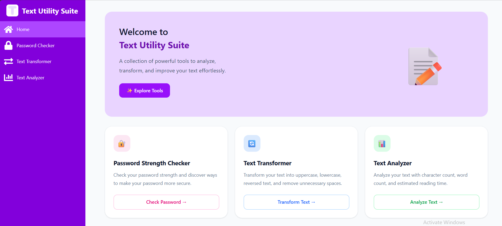
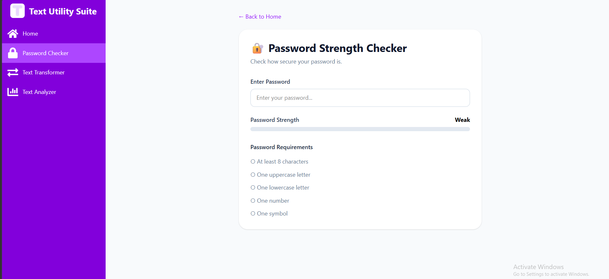
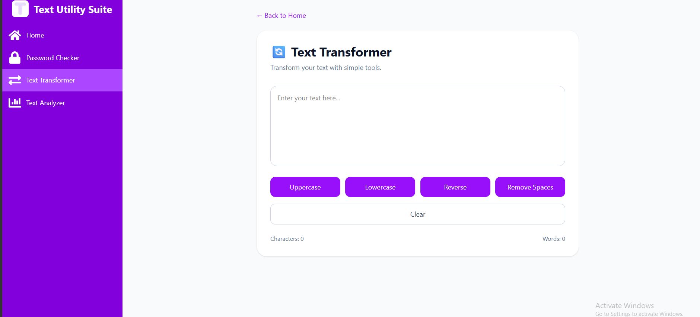
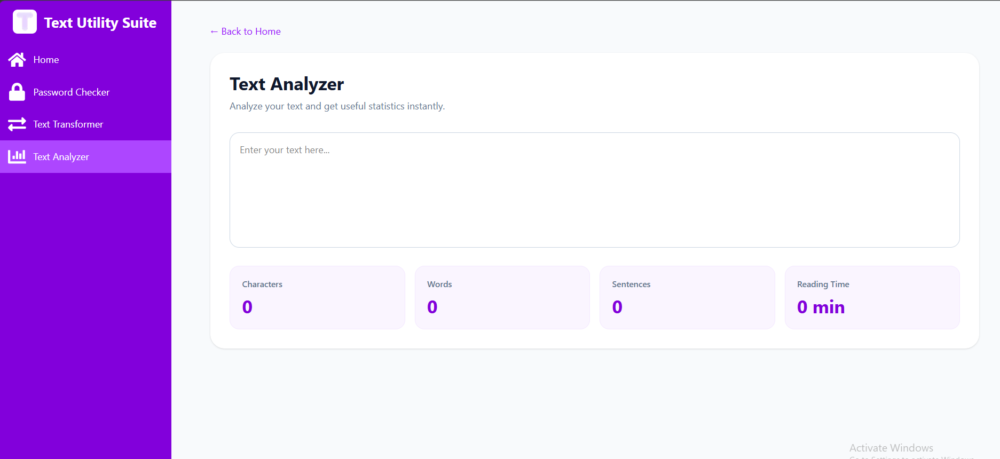

# 📝 Text Utility Suite

A responsive React application that brings together a collection of useful text-based tools in one place.

Text Utility Suite allows users to check password strength, transform text, and analyze written content through a clean and responsive interface.

## 🚀 Live Demo

[View Live Demo](https://text-utility-suite.vercel.app/)

## ✨ Features

### 🔐 Password Strength Checker

Evaluate password strength based on common security requirements.

- Checks password length
- Checks for uppercase letters
- Checks for lowercase letters
- Checks for numbers
- Checks for special characters
- Provides a visual strength indicator
- Displays password strength feedback

### 🔄 Text Transformer

Transform text quickly using different text manipulation tools.

- Convert text to uppercase
- Convert text to lowercase
- Convert text to title case
- Reverse text
- Remove extra spaces
- View transformed text instantly

### 📊 Text Analyzer

Analyze written content and receive useful statistics in real time.

- Character count
- Word count
- Sentence count
- Estimated reading time
- Live updates as text is entered

## 🛠️ Technologies

- React
- JavaScript
- Tailwind CSS
- React Icons
- Vite

## 🧠 What I Learned

Building this project helped me strengthen my understanding of:

- React state management with `useState`
- Controlled form inputs
- Event handling
- Conditional rendering
- Dynamic calculations
- String manipulation
- Regular expressions
- Array methods such as `map()`, `filter()`, and `split()`
- Responsive design with Tailwind CSS
- Component-based React architecture
- Building reusable UI patterns

## 📸 Screenshots

### Home



### Password Strength Checker



### Text Transformer



### Text Analyzer



## ⚙️ Getting Started

### 1. Clone the repository

```bash
git clone https://github.com/olajideIfe/text-utility-suite.git

Navigate to the project folder:

```bash
cd text-utility-suite
```

Install dependencies:

```bash
npm install
```

Start the development server:

```bash
npm run dev
```

## 🔮 Future Improvements

- Add copy-to-clipboard functionality
- Add more text transformation tools
- Add more detailed text statistics
- Add dark mode
- Improve accessibility
- Add additional password security checks
- Add more text analysis features
- Add more customization options

## 👩‍💻 Author

Built by **Ifedolapo Olajide** as part of my journey learning React and modern frontend development.